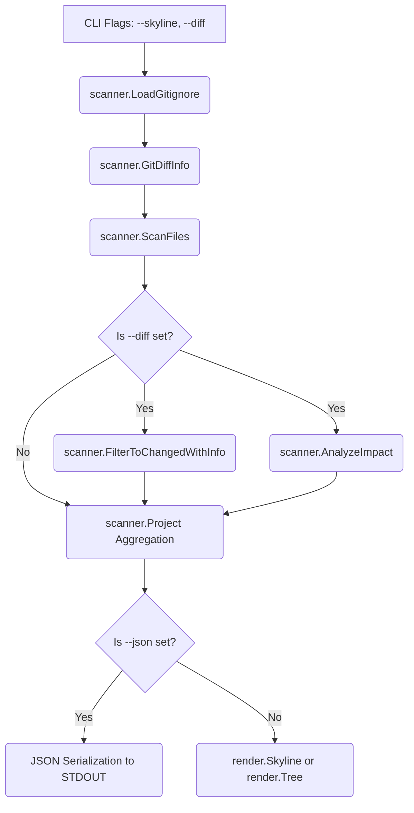
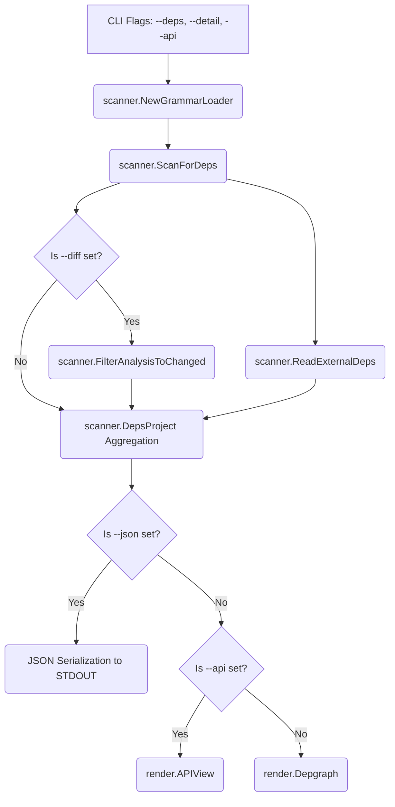

The project `codemap` is a command-line tool written in Go designed to analyze a codebase and output its structure, dependencies, or a visualization (skyline) for consumption by LLMs or developers. The data flow is highly structured, moving from raw file system and Git data through a parsing and modeling layer (`scanner`) to a final output layer (`render`).

# Data Flow Analysis

## Data Models Overview

The application defines two primary top-level data structures, each corresponding to a different operational mode, and several nested structures for granular data capture. All models are defined in `scanner/types.go`.

| Model Name | Purpose | Key Fields |
| :--- | :--- | :--- |
| **`FileInfo`** | Represents a single file in the codebase (used in Tree/Skyline mode). | `Path`, `Size`, `Ext`, `Tokens` (estimated), `IsNew`, `Added`, `Removed` (for diff mode). |
| **`Project`** | Top-level model for Tree/Skyline mode. | `Root`, `Mode`, `Animate`, `Files` (`[]FileInfo`), `DiffRef`, `Impact` (`[]ImpactInfo`). |
| **`FuncInfo`** | Represents a function or method definition. | `Name`, `Signature`, `Receiver`, `IsExported`, `Line`. |
| **`TypeInfo`** | Represents a type definition (struct, class, interface, etc.). | `Name`, `Kind` (`TypeKind` enum), `Fields` (`[]string`), `Methods` (`[]string`), `IsExported`, `Line`. |
| **`FileAnalysis`** | Holds extracted structural data for a single file (used in Dependency mode). | `Path`, `Language`, `Functions` (`[]FuncInfo`), `Types` (`[]TypeInfo`), `Imports` (`[]string`). |
| **`DepsProject`** | Top-level model for Dependency mode. | `Root`, `Mode`, `Files` (`[]FileAnalysis`), `ExternalDeps` (`map[string][]string`), `DiffRef`, `DetailLevel`. |
| **`DetailLevel`** | Integer enum (`0`, `1`, `2`) controlling the verbosity of extracted data. | `DetailNone` (names only), `DetailSignature` (names + signatures), `DetailFull` (signatures + type fields). |

## Data Transformation Map

Data flows through the system in a pipeline: **Source Data -> Scanner/Modeling -> Project Struct -> Renderer/Serialization.**

| Stage | Input Data | Transformation Logic | Output Data Model |
| :--- | :--- | :--- | :--- |
| **1. File System Scan** | File paths, sizes, and `.gitignore` rules. | `scanner.ScanFiles`: Walks the directory tree, applies gitignore filtering, calculates file size, determines extension, and estimates `Tokens` using a constant `CharsPerToken` heuristic. | `[]FileInfo` |
| **2. Git Diff Analysis** | Git history (`main.go` calls `scanner.GitDiffInfo`). | `scanner.GitDiffInfo`: Executes Git commands to find changed files and line-level additions/deletions against a reference branch. | `scanner.DiffInfo` (internal struct) |
| **3. Dependency Analysis** | Source code file content, `DetailLevel`, Tree-sitter grammars. | `scanner.ScanForDeps`: Iterates over files, uses Tree-sitter to parse the AST, and extracts symbols (functions, types, imports) based on the requested `DetailLevel`. | `[]FileAnalysis` |
| **4. Filtering** | `[]FileInfo` or `[]FileAnalysis`, and `DiffInfo`. | `scanner.FilterToChangedWithInfo` / `scanner.FilterAnalysisToChanged`: Filters the list of files/analyses to only include those marked as changed by Git. | Filtered `[]FileInfo` or `[]FileAnalysis` |
| **5. Project Aggregation** | Filtered file data, root path, mode flags. | `main.go` logic: Aggregates all processed data into either a `scanner.Project` or `scanner.DepsProject` structure. | `scanner.Project` or `scanner.DepsProject` |
| **6. Output Generation** | `Project` or `DepsProject` struct. | `encoding/json` or `render` package functions (`Tree`, `Skyline`, `Depgraph`, `APIView`). | JSON string or formatted terminal output. |

## Storage Interactions

The application is primarily a read-only analysis tool and does not interact with a traditional database or persistent storage for its operational data.

*   **Primary Data Source:** The local file system, accessed via `os` and `filepath` functions (e.g., `filepath.WalkDir` in `scanner/walker.go`).
*   **External Tool Interaction:** The application relies on the Git command-line tool to retrieve diff information (`scanner.GitDiffInfo`).
*   **External Data Files:**
    *   `.gitignore`: Read to determine which files to exclude from the scan.
    *   Tree-sitter Grammars: Loaded from a configured directory (checked by `scanner.NewGrammarLoader`) to enable source code parsing.
    *   External Dependency Files: `scanner.ReadExternalDeps` is used to read external dependency information (e.g., `go.mod` for Go projects).

## Validation Mechanisms

Data validation is minimal and primarily focused on input and prerequisites:

1.  **Path Validation:** `main.go` checks if the root path can be resolved to an absolute path.
2.  **Git Reference Validation:** When `--diff` is used, `main.go` checks for errors from `scanner.GitDiffInfo`, ensuring the provided `--ref` is a valid Git branch or reference.
3.  **Grammar Availability:** In dependency mode (`--deps`), `main.go` checks if Tree-sitter grammars are available using `loader.HasGrammars()`. If not, it prints an error and exits, preventing the core parsing logic from running without its required data source.
4.  **Exported Symbol Logic:** The `scanner.IsExportedName` function in `scanner/types.go` implements language-specific logic (e.g., Go's uppercase rule, Python's lack of leading underscore) to determine if a symbol should be considered part of the public API surface. This is a form of data validation/classification during the symbol extraction phase.

## State Management Analysis

The application is stateless and operates in a single execution cycle:

1.  **Configuration State:** Command-line flags are parsed and stored as local variables in `main.go` (e.g., `skylineMode`, `depsMode`, `detailLevel`). These variables determine the execution path and the final output format.
2.  **In-Memory Data Structures:** All extracted data (`FileInfo`, `FileAnalysis`, etc.) is held entirely in memory within the `scanner.Project` or `scanner.DepsProject` structs. These structs represent the complete, immutable state of the analysis result for the current run.
3.  **No Caching:** There are no explicit caching mechanisms (like Redis or Memcached) or persistence layers (like a database) to store results between runs. Every execution starts from scratch by scanning the file system and parsing the source code.

## Serialization Processes

Serialization is handled by the standard Go `encoding/json` package when the `--json` flag is provided.

*   **Custom Serialization:** The `FuncInfo` struct in `scanner/types.go` implements custom `MarshalJSON` and `UnmarshalJSON` methods.
    *   **Purpose:** This allows `FuncInfo` to be serialized as a simple string (just the function name) if no extended detail (signature, receiver, line number) is present. This ensures backward compatibility and a more compact JSON output when the detail level is low.
    *   **Deserialization:** The custom `UnmarshalJSON` handles both the simple string format and the full object format, ensuring robustness when reading previously generated JSON.

## Data Lifecycle Diagrams

### Lifecycle 1: Tree/Skyline Mode

### Lifecycle 2: Dependency Mode

