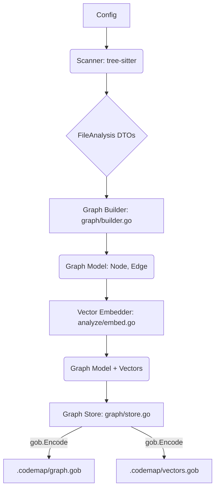

The project is a code analysis tool written in Go that processes source code using `tree-sitter` to build a knowledge graph and generate various reports (dependency graphs, file listings, etc.). The data flow is characterized by a pipeline: **Configuration -> Scanning/Parsing -> Graph Building/Storage -> Retrieval/Analysis -> Rendering/Output.**

# Data Flow Analysis

## Data Models Overview

The system utilizes distinct data models for different stages of the data lifecycle:

| Model Name | Location | Purpose | Key Fields/Structure |
| :--- | :--- | :--- | :--- |
| **`FileInfo`** | `scanner/types.go` | File metadata and size metrics. | `Path` (string), `Size` (int64), `Ext` (string), `Tokens` (int), `IsNew` (bool), `Added` (int), `Removed` (int). |
| **`FuncInfo`** | `scanner/types.go` | Extracted function/method details. | `Name` (string), `Signature` (string), `Receiver` (string), `IsExported` (bool), `Line` (int), `ParamCount` (int). |
| **`TypeInfo`** | `scanner/types.go` | Extracted type definitions (structs, classes, etc.). | `Name` (string), `Kind` (`TypeKind`), `Fields` ([]string), `Methods` ([]string), `IsExported` (bool), `Line` (int). |
| **`FileAnalysis`** | `scanner/types.go` | Intermediate DTO for scanner output. | `Path` (string), `Language` (string), `Functions` ([]`FuncInfo`), `Types` ([]`TypeInfo`), `Imports` ([]string). |
| **`Node`** | `graph/types.go` | Core entity in the knowledge graph. | `ID` (string), `Type` (`NodeType`), `Name` (string), `File` (string), `Line` (int), `Data` (map[string]any). |
| **`Edge`** | `graph/types.go` | Relationship between two nodes. | `SourceID` (string), `TargetID` (string), `Type` (`EdgeType`), `Weight` (float64). |
| **`Graph`** | `graph/types.go` | The complete knowledge graph structure. | `Nodes` (map[string]*`Node`), `Edges` ([]`Edge`), `Vectors` (map[string][]float32). |
| **`Config`** | `config/config.go` | Application configuration. | `Root` (string), `Mode` (string), `DetailLevel` (int), `CacheDir` (string), `LLM` (`LLMConfig`), `IgnoredPaths` ([]string). |
| **`CacheEntry`** | `cache/cache.go` | Data structure for cached analysis results. | `Key` (string), `Data` ([]byte), `Timestamp` (time.Time). |

## Data Transformation Map

Data undergoes significant transformation as it moves from raw source code to the final structured output:

1.  **Raw Source Code to Abstract Syntax Tree (AST):**
    *   **Source:** Files on disk.
    *   **Transformation:** The `scanner` package uses `tree-sitter` (via `scanner/grammar.go`) to parse the raw file content into a language-specific AST.
2.  **AST to Scanner DTOs (`FileAnalysis`):**
    *   **Source:** `tree-sitter` AST nodes.
    *   **Transformation:** The `scanner/walker.go` and related files traverse the AST, applying language-specific queries (`scanner/queries/*.scm`) to extract symbols (functions, types, imports). This data is mapped into `FuncInfo`, `TypeInfo`, and finally aggregated into `FileAnalysis`.
    *   **Logic:** `scanner/types.go:IsExportedName` applies language-specific rules (e.g., Go's capitalization rule) to transform a symbol name into the `IsExported` boolean field.
3.  **Scanner DTOs to Graph Model (`Node`, `Edge`):**
    *   **Source:** `FileAnalysis` structures.
    *   **Transformation:** The `graph/builder.go` component converts the structured analysis data into a graph representation.
        *   Files, functions, and types become `Node`s.
        *   Imports, function calls (inferred by the scanner), and type relationships become `Edge`s.
        *   The `Data` field in `Node` is used to store additional, unstructured information.
4.  **Graph Model to Vector Embeddings:**
    *   **Source:** `Node` data (e.g., function signatures, file content).
    *   **Transformation:** The `graph/vectors.go` component uses an external embedding service (via `analyze/embed.go`) to transform textual data into high-dimensional vector representations (`[]float32`). These are stored in the `Graph.Vectors` map.
5.  **Graph/File Data to Output (JSON/Rendered Text):**
    *   **Source:** `Graph` object or `Project`/`DepsProject` DTOs.
    *   **Transformation:** The data is serialized to JSON for machine-readable output (e.g., `DepsProject` in `scanner/types.go`). For human-readable output, the `render` package transforms the data into formatted text (e.g., dependency graphs, file trees).

## Storage Interactions

The application uses a file-based persistence mechanism for its core knowledge graph and a simple key-value store for caching.

| Component | Mechanism | Data Stored | Persistence Pattern |
| :--- | :--- | :--- | :--- |
| **Knowledge Graph** | File I/O (`graph/store.go`) | `Graph` object (Nodes, Edges, Vectors). | **Serialization/Persistence:** Uses the `encoding/gob` format to serialize the entire `Graph` structure to a file (`.codemap/graph.gob`). |
| **Vector Embeddings** | File I/O (`graph/store.go`) | `Graph.Vectors` map. | **Separate Persistence:** Vector data is stored separately using `encoding/gob` to a file (`.codemap/vectors.gob`), likely for faster loading or modularity. |
| **Analysis Cache** | File I/O (`cache/cache.go`) | Analysis results (e.g., LLM responses, file analysis). | **Key-Value Cache:** Stores data in a directory (`.codemap/cache`) where the filename is a hash of the key (e.g., `0c7717963afa65767dd7a161285b79dd.json`). The content is stored as raw bytes, often JSON. |
| **Configuration** | File I/O (`config/config.go`) | Application settings. | **Configuration Loading:** Reads settings from environment variables and potentially a configuration file (though not explicitly shown in the provided file list, the `Config` struct suggests this). |

## Validation Mechanisms

Data validation is primarily focused on configuration and input data integrity, rather than complex business logic validation.

*   **Configuration Validation:** The `config` package is responsible for ensuring that necessary parameters (like `Root` directory, `Mode`, and `LLMConfig` details) are present and correctly formatted before the main execution flow begins.
*   **Symbol Export Validation:** The `scanner/types.go:IsExportedName` function performs a form of data validation/classification on symbol names based on language rules (Go, Python, Rust) to determine public visibility.
*   **Input Path Validation:** The `scanner` package must validate file paths and directory structures, often involving checks against the `IgnoredPaths` list from the `Config` to filter out irrelevant data.

## State Management Analysis

The application's state is managed in a centralized, immutable-like fashion during the core processing phase.

1.  **Initial State (Configuration):** The `Config` struct holds the initial, global state for the application run (e.g., root directory, execution mode, detail level). This state is loaded once and passed to subsequent components.
2.  **Intermediate State (Scanner DTOs):** The `FileAnalysis` and `DepsProject` structs hold the intermediate state of the code analysis. This state is transient and is either immediately consumed by the graph builder or serialized to JSON for output.
3.  **Persistent State (Graph):** The `Graph` struct in `graph/types.go` is the central, long-term state of the codebase knowledge. It is loaded from disk, modified (built/updated), and then persisted back to disk. This is the primary form of state management for the core knowledge base.
4.  **Caching State:** The `cache.Cache` object manages the state of previously computed results, acting as a short-term, external state store to prevent redundant work.

## Serialization Processes

Serialization is a critical part of the data flow, used for persistence, caching, and output generation.

*   **`encoding/gob`:** Used for high-performance serialization of the complex Go data structures (`Graph`, `Vectors`) for persistence to the `.codemap` directory. This is the primary mechanism for internal data storage.
*   **`encoding/json`:** Used for external data exchange and human-readable output.
    *   The `scanner/types.go:FuncInfo` implements custom `MarshalJSON` and `UnmarshalJSON` methods to handle backward compatibility, allowing it to be serialized as a simple string (name) or a full object, demonstrating a flexible DTO pattern.
    *   Cache entries are often stored as JSON (`*.json` files in the cache directory).
*   **Vector Serialization:** Vector embeddings (`[]float32`) are serialized using `gob` in `graph/store.go`, which is a common pattern for storing large numerical arrays efficiently.

## Data Lifecycle Diagrams

### 1. Knowledge Graph Building and Persistence



### 2. Analysis and Retrieval Flow

```mermaid
graph TD
    A[User Query] --> B[Retriever: analyze/retriever.go]
    B --> C{Cache: cache/cache.go}
    C -- Cache Hit --> K[Render Output]
    C -- Cache Miss --> D[Graph Store: Load Graph]
    D --> E[Vector Query: graph/query.go]
    E --> F[LLM Client: analyze/client.go]
    F -- Context + Prompt --> G[LLM API (Anthropic/Gemini/OpenAI)]
    G -- LLM Response --> H[Analysis Result]
    H --> I[Cache: Store Result]
    H --> K[Render Output: render/*.go]
```