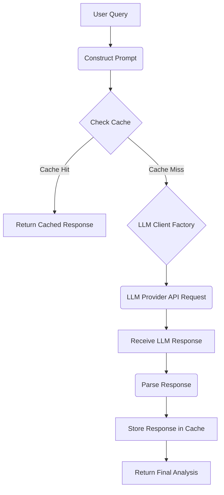

The project is a code analysis tool, likely generating a knowledge graph from source code and using LLMs for analysis. The data flow centers around configuration, code scanning, graph construction, and LLM interaction.

# Data Flow Analysis

## Data Models Overview

The core data models define the application's configuration and the structure of the code graph.

| Model | Location | Purpose | Key Fields/Structure |
| :--- | :--- | :--- | :--- |
| **Config** | `config/config.go` | Application configuration, loaded from YAML and environment variables. | `LLM` (`LLMConfig`), `Cache` (`CacheConfig`), `Debug` (bool). |
| **LLMConfig** | `config/config.go` | Settings for LLM providers and requests. | `Provider` (enum: Ollama, OpenAI, Anthropic, Gemini), `Model`, API Keys, URLs, `EmbeddingModel`, `Temperature`, `MaxTokens`. |
| **CacheConfig** | `config/config.go` | Settings for the local file cache. | `Enabled` (bool), `Dir` (string), `TTLDays` (int). |
| **Source** | `analyze/source.go` | Represents a piece of source code content for LLM processing. | `Path` (string), `Content` (string), `Language` (string), `Symbols` ([]`scanner.Symbol`). |
| **Symbol** | `scanner/types.go` | Represents a code entity (function, class, variable) extracted by the scanner. | `ID` (string), `Name` (string), `Type` (string), `Path` (string), `StartLine`, `EndLine`, `Docstring` (string), `References` ([]string). |
| **Graph Node/Edge** | `graph/types.go` | The fundamental units of the code knowledge graph. | **Node:** `ID`, `Type`, `Properties` (map[string]any). **Edge:** `SourceID`, `TargetID`, `Type`, `Properties`. |
| **VectorStore** | `graph/vectors.go` | Stores embeddings for graph nodes to enable semantic search. | Key-value store mapping Node ID to vector embedding. |

## Data Transformation Map

Data undergoes several key transformations as it moves through the system:

| Stage | Input Data | Transformation/Component | Output Data |
| :--- | :--- | :--- | :--- |
| **1. Configuration Loading** | Defaults, YAML files, Environment variables. | `config.Load()`: YAML deserialization, environment variable overriding, merging. | Validated `*config.Config` object. |
| **2. Code Scanning** | File system content (raw source code). | `scanner.Walker`, `scanner.Grammar`: Tree-sitter parsing, AST traversal. | Structured data: `[]scanner.Symbol`, `[]scanner.Call`, `[]scanner.Dependency`. |
| **3. Graph Building** | Structured code data (`Symbol`, `Call`, `Dependency`). | `graph.Builder`: Mapping code entities to graph nodes and relationships (edges). | `graph.Store` (in-memory graph structure). |
| **4. Embedding Generation** | Code content (e.g., function body, symbol definition). | `analyze.Embedder`: LLM API call to generate vector representation. | `[]float32` (vector embedding). |
| **5. Graph Persistence** | In-memory `graph.Store` and `VectorStore`. | `graph.Store.Save()`: Serialization using `encoding/gob`. | Binary files (`.codemap/graph.gob`, `.codemap/vectors.gob`). |
| **6. LLM Analysis** | User query, `analyze.Source` (context), `analyze.Prompts`. | `analyze.Client.Analyze()`: Prompt construction, API request/response. | Raw LLM response (JSON/text), then parsed into structured analysis. |

## Storage Interactions

The application uses two primary storage mechanisms: file-based persistence for the knowledge graph and a file-based cache for LLM responses.

| Storage Mechanism | Location | Data Model | Persistence Pattern |
| :--- | :--- | :--- | :--- |
| **Knowledge Graph** | `.codemap/graph.gob` | Graph Nodes and Edges | **Binary Serialization (Gob):** The entire in-memory graph structure is serialized to a binary file for fast loading and saving. |
| **Vector Embeddings** | `.codemap/vectors.gob` | Vector Embeddings | **Binary Serialization (Gob):** The vector store (likely a map of ID to vector) is persisted separately. |
| **LLM Response Cache** | `CacheConfig.Dir` (default: `.codemap/cache`) | LLM API responses (raw text/JSON) | **Key-Value File Cache:** The `cache` package implements a file-based cache. The cache key is likely a hash of the request/prompt. It supports a Time-To-Live (`TTLDays`) for expiry, although the default is no expiry (0). |
| **Configuration** | `~/.config/codemap/config.yaml`, `.codemap/config.yaml` | `Config` | **YAML Serialization:** Human-readable configuration files are used for persistence. |

## Validation Mechanisms

Data validation is primarily focused on the configuration and the integrity of the LLM interaction setup.

1.  **Configuration Validation (`config/config.go`):**
    *   The `(*Config).Validate()` method ensures that required fields are present based on the selected LLM provider.
    *   **Logic:** If `LLM.Provider` is set to a specific value (e.g., `ProviderOpenAI`), the corresponding API key (`OpenAIAPIKey`) must not be empty.
    *   **Error Handling:** Validation failures result in a descriptive error message returned by `config.Load()`, preventing the application from starting with an incomplete configuration.

2.  **Input Validation (Implicit):**
    *   The `scanner` package relies on the robustness of the Tree-sitter parsers. While it doesn't perform explicit data validation on the source code content, the parsing process implicitly validates the code's syntax and structure, failing gracefully or producing an incomplete AST on malformed input.

## State Management Analysis

The application's state is managed across three main components:

1.  **Configuration State:** The `*config.Config` object holds the global, immutable settings for the application's runtime. This is the initial state loaded at startup.
2.  **In-Memory Graph State:** The `graph.Store` and `graph.VectorStore` hold the entire knowledge graph and its associated embeddings. This is the primary mutable state during the analysis phase.
    *   The state is loaded from `.gob` files at the start of a graph operation and persisted back to disk upon completion.
3.  **Cache State:** The `cache` package manages the state of past LLM interactions. This state is externalized to the file system and is managed independently of the main graph state, acting as a persistent layer for memoization.

The overall approach is a **Load-Process-Save** pattern, where the graph state is loaded into memory, modified (e.g., by adding new symbols or embeddings), and then fully persisted back to disk.

## Serialization Processes

The application uses two main serialization formats:

1.  **YAML (Human-Readable Configuration):**
    *   **Purpose:** Configuration files (`config.yaml`).
    *   **Mechanism:** The `gopkg.in/yaml.v3` library is used for deserializing configuration data into the `Config` struct.

2.  **Gob (Binary Data Persistence):**
    *   **Purpose:** Persisting the core data structures of the knowledge graph and vector store.
    *   **Mechanism:** The `encoding/gob` package is used to serialize Go data structures (`graph.Store`, vector data) into a compact binary format. This is chosen for performance in saving and loading complex, in-memory Go objects.

3.  **JSON (LLM Communication):**
    *   **Purpose:** Communication with LLM APIs (e.g., OpenAI, Anthropic, Gemini).
    *   **Mechanism:** The `analyze` package uses JSON for sending requests and receiving responses from the LLM providers. The raw JSON response is then deserialized into a structured format for further processing.

## Data Lifecycle Diagrams

### 1. Code Analysis and Graph Building Lifecycle

```mermaid
graph TD
    A[Start Application] --> B(Load Config);
    B --> C{Code Scanner};
    C --> D[Read Source Files];
    D --> E(Tree-sitter Parsing);
    E --> F[Extract Symbols, Calls, Deps];
    F --> G{Graph Builder};
    G --> H[Load Graph from .gob];
    G --> I[Create/Update Nodes & Edges];
    I --> J[Generate Embeddings (LLM API)];
    J --> K[Update Vector Store];
    K --> L[Save Graph & Vectors to .gob];
    L --> M[Graph Ready for Query];
```

### 2. LLM Interaction and Caching Lifecycle

