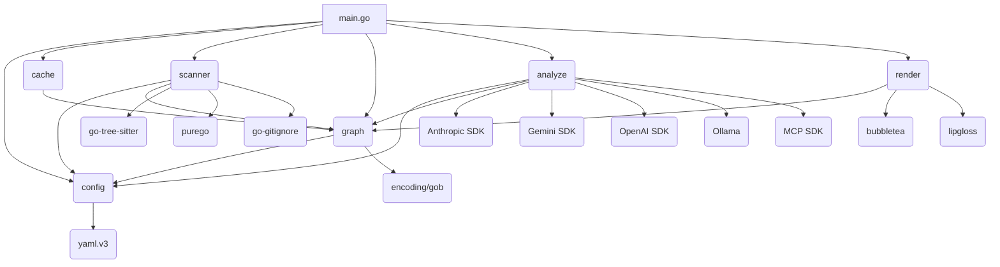

# Dependency Analysis

## Internal Dependencies Map

The project is structured into several cohesive Go packages, with dependencies flowing from the core logic (`scanner`, `graph`) up to the application entry point (`main`) and user interface (`render`, `analyze`).

| Dependent Package | Dependencies (Internal) | Description |
| :--- | :--- | :--- |
| `main` (Root) | `config`, `cache`, `scanner`, `graph`, `analyze`, `render` | Application entry point, responsible for initialization and orchestrating the main workflow. |
| `analyze` | `config`, `graph` | Contains the logic for code analysis using LLMs. It depends on `config` for API keys/settings and `graph` for retrieving and storing code data. |
| `scanner` | `config`, `graph` | The core component for parsing source code. It depends on `config` for settings (e.g., ignored files) and interacts with `graph` to populate the code structure data. |
| `graph` | `config` | Manages the in-memory representation of the codebase (the knowledge graph) and handles persistence (loading/saving `.gob` files). Depends on `config` for file paths. |
| `render` | `graph` | Handles the Terminal User Interface (TUI) and visualization of the code map and dependency graphs. It consumes data structures provided by the `graph` package. |
| `cache` | `graph` | Likely handles caching logic for the graph data, interacting with the `graph` package's persistence layer. |
| `mcp` | (None visible) | Appears to be a separate entry point or utility for the Model Context Protocol integration, likely depending on `config` and the external MCP SDK. |

## External Libraries Analysis

The project is built on Go and relies heavily on libraries for TUI, code parsing, and configuration management.

| Library | Version | Purpose |
| :--- | :--- | :--- |
| `github.com/tree-sitter/go-tree-sitter` | `v0.25.0` | **Core Dependency:** Provides the necessary bindings for the `scanner` package to perform abstract syntax tree (AST) parsing for various languages. |
| `github.com/ebitengine/purego` | `v0.9.1` | Used for calling C functions from Go, likely to interface with the compiled Tree-sitter grammars (C libraries). |
| `github.com/charmbracelet/bubbletea` | `v1.3.10` | **TUI Framework:** The primary library for building the interactive terminal user interface, used by the `render` package. |
| `github.com/charmbracelet/lipgloss` | `v1.1.0` | Used for styling and layout within the TUI, supporting `bubbletea`. |
| `github.com/modelcontextprotocol/go-sdk` | `v1.1.0` | **Service SDK:** Integration with the Model Context Protocol (MCP), suggesting a standardized way to interact with LLMs. |
| `gopkg.in/yaml.v3` | `v3.0.1` | Used by the `config` package for parsing configuration files. |
| `github.com/sabhiram/go-gitignore` | (latest) | Used by the `scanner` package to respect `.gitignore` rules when traversing the file system. |
| `golang.org/x/term` | `v0.37.0` | Standard Go library for terminal I/O and state management. |

## Service Integrations

The project's core function involves integrating with various Large Language Models (LLMs) for code analysis. This is managed primarily within the `analyze` package.

| Service/API | Integration Point | Description |
| :--- | :--- | :--- |
| **Model Context Protocol (MCP)** | `github.com/modelcontextprotocol/go-sdk` | A primary integration layer, likely used to abstract the specific LLM provider. The `mcp` directory suggests a dedicated component for this. |
| **Anthropic** | `analyze/anthropic.go` | Direct integration with the Anthropic API (e.g., Claude models). |
| **Google Gemini** | `analyze/gemini.go` | Direct integration with the Gemini API. |
| **OpenAI** | `analyze/openai.go` | Direct integration with the OpenAI API (e.g., GPT models). |
| **Ollama** | `analyze/ollama.go` | Integration with the Ollama local LLM server, enabling local or self-hosted model analysis. |

The `analyze` package acts as a set of API clients, providing a unified interface (`analyze/client.go`) to the core application logic, regardless of the underlying LLM provider.

## Dependency Injection Patterns

The project utilizes a **Factory Pattern** for managing the LLM clients, which is a form of dependency management.

*   **Factory Pattern:** The existence of `analyze/factory.go` indicates that the application uses a factory function (`NewClient` or similar) to instantiate the correct LLM client (`AnthropicClient`, `GeminiClient`, etc.) based on runtime configuration (e.g., the `LLM_PROVIDER` setting).
*   **Constructor Injection (Implicit):** The main application logic in `main.go` is responsible for creating instances of the core components (`Config`, `GraphStore`, `Scanner`, `Analyzer`) and passing them to dependent components during initialization. For example, the `Analyzer` likely receives the `Config` and `Graph` instances in its constructor.

There is no evidence of a full-fledged Dependency Injection container (like `wire` or `fx`), suggesting manual wiring of dependencies in the `main` function.

## Module Coupling Assessment

| Module | Cohesion | Coupling | Rationale |
| :--- | :--- | :--- | :--- |
| `scanner` | High | Low-to-Moderate | Highly focused on AST parsing and symbol extraction. Coupled to `config` and the `graph` data structures, but its core logic is isolated via `tree-sitter`. |
| `graph` | High | Low | Manages the single responsibility of data storage and retrieval. Coupled only to `config` for file paths. |
| `analyze` | Moderate | High | Responsible for multiple external LLM integrations. The coupling to external services is managed by the internal `factory` pattern, but it is tightly coupled to `config` and `graph` data structures. |
| `render` | High | Low | Focused on TUI presentation. Coupled to `graph` for data and `bubbletea`/`lipgloss` for presentation logic. |
| `config` | High | Low | Only handles configuration loading. Low coupling to other internal modules (only provides data). |

The overall architecture shows good separation of concerns, with the `graph` package acting as the central data hub, minimizing direct coupling between `scanner`, `analyze`, and `render`.

## Dependency Graph

The following graph illustrates the primary internal dependencies, with external dependencies noted at the package level.

## Potential Dependency Issues

1.  **Tight Coupling to External LLM SDKs:** While the `analyze/factory.go` pattern helps, the `analyze` package contains separate files for each LLM provider (`anthropic.go`, `gemini.go`, etc.). If the project were to support many more LLMs, this package could become bloated. The reliance on the **Model Context Protocol (MCP)** SDK suggests an attempt to mitigate this, but the direct provider files indicate that specific SDKs are still being used.
2.  **Tree-sitter Complexity:** The `scanner` package relies on `github.com/ebitengine/purego` and the C bindings of Tree-sitter grammars. This introduces a dependency on CGO/FFI, which can complicate cross-platform compilation and deployment. The large number of grammar subdirectories (`/scanner/.grammar-build/`) confirms this complexity.
3.  **TUI Framework Lock-in:** The `render` package is tightly coupled to the `charmbracelet/bubbletea` ecosystem. While this is a powerful and popular choice for TUI, switching to a different rendering method (e.g., web UI, simple CLI output) would require a complete rewrite of the `render` package.