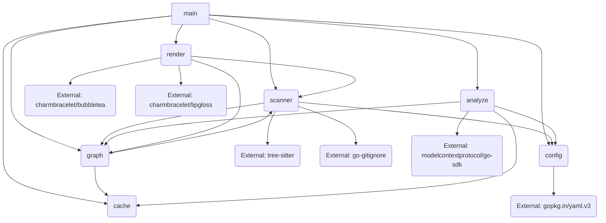

# Dependency Analysis

## Internal Dependencies Map

The project is structured into several cohesive Go packages, with the `main` package acting as the orchestrator, handling command-line arguments and coordinating the workflow.

| Package | Description | Key Dependencies |
| :--- | :--- | :--- |
| **main** (`/`) | CLI entry point and application orchestrator. | `analyze`, `cache`, `config`, `graph`, `render`, `scanner` |
| **scanner** (`/scanner`) | Core component for code analysis, parsing, and git operations. | `config`, `graph`, External: `tree-sitter/go-tree-sitter`, `sabhiram/go-gitignore` |
| **analyze** (`/analyze`) | Handles LLM-based operations (explain, summarize, embed). | `config`, `cache`, `graph`, External: `modelcontextprotocol/go-sdk` |
| **graph** (`/graph`) | Manages the knowledge graph (building, storing, querying). | `scanner`, `config`, `cache` (implied for persistence) |
| **render** (`/render`) | Responsible for all CLI output and visualizations (tree, skyline, depgraph). | `scanner`, `graph`, External: `charmbracelet/bubbletea`, `charmbracelet/lipgloss` |
| **config** (`/config`) | Handles application configuration loading and parsing. | External: `gopkg.in/yaml.v3` |
| **cache** (`/cache`) | Provides a persistent caching layer for LLM responses and graph data. | (Low internal dependencies) |

**Key Internal Relationships:**

*   **Core Data Flow:** `scanner` generates raw code data (symbols, calls) -> `graph` consumes this data to build the index -> `analyze` and `render` consume data from `graph` for their respective outputs.
*   **Configuration:** `config` is a foundational dependency, used by `main`, `scanner`, and `analyze` to determine behavior (e.g., which LLM model to use).
*   **Decoupling:** The `analyze` package is decoupled from specific LLM implementations via a factory pattern (see Dependency Injection Patterns section).

## External Libraries Analysis

The project relies heavily on external libraries for core functionality (parsing, TUI, LLM integration, configuration).

| Library | Version | Purpose | Category |
| :--- | :--- | :--- | :--- |
| `github.com/tree-sitter/go-tree-sitter` | `v0.25.0` | Core dependency for code parsing and abstract syntax tree (AST) generation. | Code Analysis |
| `github.com/modelcontextprotocol/go-sdk` | `v1.1.0` | Standardized client for interacting with various LLM providers (MCP). | LLM/AI Integration |
| `github.com/charmbracelet/bubbletea` | `v1.3.10` | Framework for building terminal user interfaces (TUI), used for skyline/animation modes. | TUI/Rendering |
| `github.com/ebitengine/purego` | `v0.9.1` | Used for calling C functions from Go, likely for interfacing with the compiled Tree-sitter grammars. | Interoperability |
| `github.com/sabhiram/go-gitignore` | (latest commit) | Utility for parsing and applying `.gitignore` rules to file scanning. | Utility/Filesystem |
| `golang.org/x/term` | `v0.37.0` | Standard library extension for terminal manipulation (e.g., raw mode). | System/Utility |
| `gopkg.in/yaml.v3` | `v3.0.1` | Used by the `config` package for loading configuration files. | Configuration |

**Indirect Dependencies of Note (from `go.sum`):**

*   `github.com/charmbracelet/lipgloss`: Used for styling and rendering the TUI elements.
*   `golang.org/x/oauth2`: Suggests that some LLM or external service integrations (likely OpenAI/Anthropic) use OAuth2 for authentication.

## Service Integrations

The primary integration points are with Large Language Models (LLMs) and their associated APIs, managed within the `analyze` package.

| Service/System | Integration Point | Protocol/Client |
| :--- | :--- | :--- |
| **OpenAI API** | `analyze/openai.go` | Implemented via `modelcontextprotocol/go-sdk` or a direct client (likely the former, which wraps the latter). |
| **Anthropic API** | `analyze/anthropic.go` | Implemented via `modelcontextprotocol/go-sdk` or a direct client. |
| **Ollama** | `analyze/ollama.go` | Integration for local/self-hosted LLM inference. |
| **Model Context Protocol (MCP)** | `github.com/modelcontextprotocol/go-sdk` | Acts as a unified interface for all LLM interactions, abstracting the specific provider details. |
| **Git** | `scanner/git.go` | Direct execution of git commands (e.g., `git diff`) to determine changed files. |

## Dependency Injection Patterns

The project uses a **Factory Pattern** for instantiating LLM clients, which is a form of dependency management.

*   **Factory Implementation:** The `analyze/factory.go` file is responsible for creating the correct `analyze.Client` implementation (e.g., `OpenAIClient`, `AnthropicClient`, `OllamaClient`).
*   **Configuration-Driven Instantiation:** The choice of which concrete client to instantiate is driven by the application configuration loaded by the `config` package.
*   **Interface-Based Decoupling:** The `main` package and other high-level logic interact with the `analyze` functionality through an interface (likely `analyze.Client`), ensuring they are decoupled from the specific LLM provider being used.

## Module Coupling Assessment

| Module Pair | Coupling Level | Rationale |
| :--- | :--- | :--- |
| **main <-> All Internal Packages** | High (Orchestration) | `main` explicitly imports and calls functions from `analyze`, `cache`, `config`, `graph`, `render`, and `scanner`. This is expected for a CLI entry point. |
| **scanner <-> graph** | High (Data Producer/Consumer) | `scanner` is tightly coupled to `graph` as it produces the raw data (symbols, calls) that `graph` consumes to build its internal structure. Changes to the data model in `graph/types.go` would require changes in `scanner`. |
| **analyze <-> config** | Medium | `analyze` relies on `config` to determine which LLM client to use and to retrieve API keys/model names. This is a necessary configuration dependency. |
| **render <-> charmbracelet/\*** | High (External) | The `render` package is built directly on top of the `bubbletea` and `lipgloss` TUI libraries, making it highly coupled to this external ecosystem. |
| **scanner <-> tree-sitter** | High (External) | The core functionality of `scanner` (parsing) is entirely dependent on the `go-tree-sitter` library and the pre-built grammars. |

**Cohesion:** The packages exhibit good cohesion:
*   `scanner` focuses solely on code structure analysis.
*   `graph` focuses solely on data storage and retrieval.
*   `analyze` focuses solely on LLM interactions.

## Dependency Graph

The project follows a layered architecture, with dependencies flowing generally downwards from the orchestrator (`main`) to the core utilities (`config`, `cache`) and data producers (`scanner`), and then to the consumers (`graph`, `analyze`, `render`).

## Potential Dependency Issues

1.  **Tight Coupling to Tree-sitter Grammars:** The `scanner` package is highly dependent on the specific structure and compilation of the Tree-sitter grammars (visible in `/scanner/.grammar-build`). Any update to a grammar requires a rebuild process (`scanner/build-grammars.sh`), which introduces complexity and a build-time dependency on C/C++ toolchains (via `purego` and the underlying C libraries).
2.  **Monolithic Orchestrator (`main`):** The `main` package is responsible for initializing and coordinating all major modes (`--index`, `--query`, `--explain`, `--summarize`, `--deps`, etc.). While common in CLI tools, this makes `main.go` large and tightly coupled to every other package. Refactoring the mode logic into a dedicated `cmd` package could improve modularity.
3.  **LLM Client Proliferation:** While the Factory pattern in `analyze` is good, the existence of separate files for `anthropic.go`, `openai.go`, and `ollama.go` suggests that the `modelcontextprotocol/go-sdk` might not fully abstract all necessary client-specific logic, or that the project maintains direct client implementations for flexibility. This increases the surface area for maintenance when new LLM features are released.
4.  **TUI Dependency:** The `render` package's reliance on the `charmbracelet` ecosystem is a significant dependency. While it provides rich TUI features, it ties the rendering logic to a specific set of terminal capabilities and libraries.