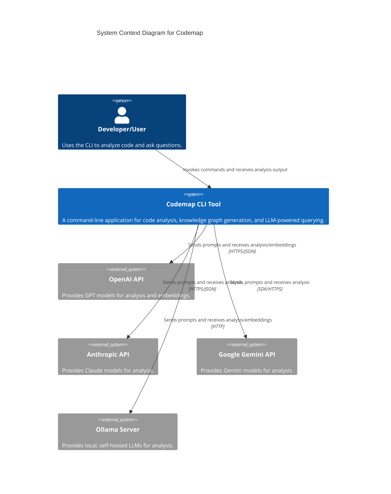

# Codemap: Code Analysis and Knowledge Graph System

## Project Overview

**Codemap** is a powerful Command Line Interface (CLI) application written in Go designed to transform a codebase into a structured, queryable knowledge graph. By integrating with various Large Language Models (LLMs), it enables developers to perform deep, context-aware analysis, semantic search, and natural language querying of their source code.

### Purpose and Main Functionality

The primary purpose of Codemap is to enhance code comprehension, developer onboarding, and knowledge transfer by providing an intelligent layer over the source code. It achieves this by:

1.  **Indexing:** Parsing source code using Tree-sitter to build a persistent, language-agnostic knowledge graph of symbols, calls, and dependencies.
2.  **Analysis:** Leveraging LLMs (via a Retrieval-Augmented Generation, or RAG, pipeline) to explain complex symbols, summarize modules, and answer natural language questions about the code.
3.  **Visualization:** Rendering dependency graphs and file structures directly in the terminal.

### Key Features and Capabilities

*   **Knowledge Graph Generation:** Creates a persistent graph index (`.codemap/graph.gob`) for fast querying.
*   **Multi-LLM Support:** Seamless integration with OpenAI, Anthropic, Google Gemini, and Ollama (for local models).
*   **Semantic Search:** Uses vector embeddings to perform natural language searches over the codebase.
*   **Code Explanation:** Provides detailed, LLM-generated explanations for specific functions, types, or variables.
*   **Dependency Visualization:** Renders interactive dependency graphs in the terminal.
*   **Caching:** Implements a file-based cache for LLM responses to reduce API costs and improve performance.

### Likely Intended Use Cases

*   **Developer Onboarding:** Quickly understand the architecture and data flow of a new project.
*   **Code Auditing:** Identify all callers or callees of a specific function or API endpoint.
*   **Impact Analysis:** Determine which parts of the codebase are affected by changes in a specific file or symbol.
*   **Code Comprehension:** Use natural language to ask "How does X work?" or "Where is Y implemented?".

## Table of Contents

1.  [Project Overview](#project-overview)
2.  [Architecture](#architecture)
3.  [C4 Model Architecture](#c4-model-architecture)
    *   [Context Diagram](#context-diagram)
    *   [Container Diagram](#container-diagram)
4.  [Repository Structure](#repository-structure)
5.  [Dependencies and Integration](#dependencies-and-integration)
6.  [API Documentation](#api-documentation)
7.  [Development Notes](#development-notes)
8.  [Known Issues and Limitations](#known-issues-and-limitations)
9.  [Additional Documentation](#additional-documentation)

## Architecture

Codemap follows a **Layered Architecture** with characteristics of a **Hexagonal Architecture**, ensuring the core analysis logic is decoupled from external services (LLMs) and presentation logic (TUI).

### High-level Architecture Overview

The system operates as a pipeline:

1.  **Input:** The `main` entry point receives a CLI command.
2.  **Scanning:** The `scanner` package parses the source code using Tree-sitter.
3.  **Data Storage:** The `graph` package builds and persists the knowledge graph and vector embeddings.
4.  **Intelligence:** The `analyze` package uses the graph (RAG) and external LLMs to generate insights.
5.  **Output:** The `render` package formats the results for the user.

### Technology Stack and Frameworks

| Category | Technology/Framework | Purpose |
| :--- | :--- | :--- |
| **Language** | Go (Golang) | Primary development language. |
| **Code Parsing** | Tree-sitter, `go-tree-sitter` | Generates Abstract Syntax Trees (ASTs) for deep code analysis. |
| **TUI/Rendering** | `charmbracelet/bubbletea`, `lipgloss` | Framework for building the interactive terminal user interface. |
| **Configuration** | `gopkg.in/yaml.v3` | Configuration file parsing. |
| **Data Persistence** | `encoding/gob` | Binary serialization for fast graph loading/saving. |

### Key Design Patterns

*   **Factory Pattern:** Used in the `analyze` package to instantiate the correct LLM client (OpenAI, Gemini, etc.) based on runtime configuration.
*   **Repository Pattern:** The `graph` package acts as a repository, abstracting the persistence logic for the knowledge graph.
*   **Adapter Pattern:** Concrete LLM client implementations act as adapters, translating the generic `analyze.Client` interface into provider-specific API calls.

### Component Relationships

The following diagram illustrates the primary internal dependencies and data flow between the core packages:

```mermaid
graph TD
    subgraph Presentation Layer
        R[render]: TUI & Visualization
    end

    subgraph Application/Intelligence Layer
        A[analyze]: LLM Clients, RAG, Caching
    end

    subgraph Data Layer
        G[graph]: Knowledge Graph Store, Embeddings
        C[cache]: LLM Response Cache
    end

    subgraph Infrastructure Layer
        S[scanner]: Tree-sitter Parsing
        CFG[config]: Configuration & Settings
    end

    M[main.go (CLI Entry)] --> CFG
    M --> S
    M --> G
    M --> A
    M --> R

    S -- Extracts Data --> G
    S -- Reads Settings --> CFG

    A -- Retrieves Context --> G
    A -- Reads Settings --> CFG
    A -- Reads/Writes --> C
    A -- Communicates With --> ExternalLLMs[External LLM APIs]

    G -- Reads Persistence Path --> CFG
    R -- Queries Data --> G

    style M fill:#f9f,stroke:#333
    style A fill:#ccf,stroke:#333
    style S fill:#afa,stroke:#333
    style G fill:#ffc,stroke:#333
```

## C4 Model Architecture

### Context Diagram

<details>
<summary>C4 Context Diagram: System and its Relationships</summary>


</details>

### Container Diagram

<details>
<summary>C4 Container Diagram: High-Level Technical Building Blocks</summary>

```mermaid
C4Container
    title Container Diagram for Codemap

    System_Boundary(codemap_cli, "Codemap CLI Application")
        Container(cli, "CLI Entrypoint (main)", "Go Executable", "Handles command routing, configuration loading, and orchestration.")

        Container(scanner, "Code Scanner", "Go Package (tree-sitter)", "Parses source code, extracts symbols, calls, and dependencies.")
        Container(graph, "Knowledge Graph Store", "Go Package (Gob Files)", "Manages the in-memory graph structure, persistence (.codemap/graph.gob), and vector embeddings.")
        Container(analyze, "LLM Analysis Engine", "Go Package (LLM Clients)", "Abstracts external LLM APIs, constructs prompts, manages caching, and performs RAG.")
        Container(render, "Output Renderer", "Go Package (Bubbletea/Lipgloss)", "Formats and visualizes results (TUI, dependency graphs, text output).")
        Container(cache, "LLM Response Cache", "Go Package (File System)", "Stores LLM responses to prevent redundant API calls.")

        Rel(cli, scanner, "Invokes scanning for code structure")
        Rel(cli, graph, "Loads/Saves/Queries the graph index")
        Rel(cli, analyze, "Dispatches LLM-powered analysis requests")
        Rel(cli, render, "Passes data for visualization")

        Rel(scanner, graph, "Feeds extracted symbols and dependencies")
        Rel(analyze, graph, "Retrieves code context (RAG) and stores embeddings")
        Rel(analyze, cache, "Reads/Writes LLM responses")
        Rel(analyze, external_llms, "Communicates with external APIs", "HTTPS/SDK")
    End_System_Boundary

    System_Ext(external_llms, "External LLM Providers", "OpenAI, Anthropic, Gemini, Ollama")
```
</details>

## Repository Structure

The repository is organized into functional packages, reflecting the layered architecture:

| Directory/File | Purpose |
| :--- | :--- |
| `/main.go` | The application entry point and central command router. |
| `/config` | Handles configuration loading, merging, and validation from YAML and environment variables. |
| `/scanner` | Contains the Tree-sitter integration, AST traversal logic, and symbol extraction. |
| `/graph` | Defines the knowledge graph data model, persistence (`.gob` serialization), and querying logic. |
| `/analyze` | Manages all LLM interactions, including client factories, RAG retrieval, and caching. |
| `/render` | Components for terminal visualization, including TUI elements and dependency graph rendering. |
| `/.codemap/` | The default directory for persistent data, including the graph index, vector store, and LLM cache. |

## Dependencies and Integration

### Internal Service Dependencies

The core functionality is distributed across highly cohesive internal packages:

*   **`main`** orchestrates all other packages (`config`, `scanner`, `graph`, `analyze`, `render`).
*   **`analyze`** depends on **`config`** (for API keys) and **`graph`** (for RAG context).
*   **`scanner`** depends on **`config`** (for file filtering) and feeds data to **`graph`**.
*   **`render`** depends on **`graph`** to retrieve data for visualization.

### External Service Dependencies

Codemap relies on external Large Language Model (LLM) APIs for its intelligence features.

| Service | Integration Point | Authentication Method | Purpose |
| :--- | :--- | :--- | :--- |
| **OpenAI API** | `analyze/openai.go` | `OPENAI_API_KEY` (Bearer Token) | General analysis, summarization, and vector embeddings. |
| **Anthropic API** | `analyze/anthropic.go` | `ANTHROPIC_API_KEY` (Custom Header) | General analysis and summarization. |
| **Google Gemini API** | `analyze/gemini.go` | `GEMINI_API_KEY` (SDK Initialization) | General analysis and summarization. |
| **Ollama API** | `analyze/ollama.go` | None (Local/Self-hosted) | Local analysis and embeddings. |

### Integration Pattern

The `analyze` package uses a common `analyze.Client` interface and a **Factory Pattern** (`analyze/factory.go`) to abstract the specific LLM provider. This allows the core application logic to be provider-agnostic, enabling easy switching between models via configuration.

## API Documentation

The primary API for Codemap is its command-line interface. The following table outlines the main functional "endpoints" (commands) available to the user.

| Command | Method | Description | Key Parameters |
| :--- | :--- | :--- | :--- |
| `codemap --index` | `POST` | Builds or rebuilds the internal knowledge graph index from the source code. | `[path]`, `--force` |
| `codemap --embed` | `POST` | Generates vector embeddings for all nodes in the knowledge graph, required for semantic search. | `[path]`, `--force` |
| `codemap --query` | `GET` | Queries the knowledge graph for dependencies, paths between symbols, or specific nodes. | `--from <symbol>`, `--to <symbol>`, `--depth <n>` |
| `codemap --explain` | `POST` | Fetches a symbol's source code and requests a detailed, natural language explanation from the configured LLM. | `--symbol <name>`, `--model <name>`, `--no-cache` |
| `codemap --summarize` | `POST` | Gathers code from a specified path and requests a high-level summary from the LLM. | `[path]`, `--model <name>`, `--no-cache` |
| `codemap --search` | `POST` | Performs a semantic search over the codebase using vector embeddings and a natural language query. | `--q <query>`, `--limit <n>`, `--expand` |
| `codemap --deps` | `GET` | Scans files and renders a dependency graph visualization. | `[path]`, `--detail-level <n>` |

**Authentication:** All LLM-powered commands require API keys to be set via environment variables (e.g., `OPENAI_API_KEY`, `GEMINI_API_KEY`).

## Development Notes

### Project-specific Conventions

*   **Data Persistence:** The knowledge graph and vector store are serialized using Go's built-in `encoding/gob` package for performance, resulting in binary files (`.codemap/graph.gob`, `.codemap/vectors.gob`).
*   **Configuration:** Configuration is loaded hierarchically from defaults, YAML files (`config.yaml`), and environment variables, with environment variables taking precedence.
*   **Error Handling:** Critical errors (e.g., graph loading failure, missing grammars) result in a descriptive message to `os.Stderr` and a non-zero exit code.

### Performance Considerations

*   **Caching:** A file-based cache is implemented in the `cache` package to store LLM responses, significantly reducing redundant API calls and improving perceived latency for repeated queries.
*   **Binary Serialization:** The choice of `gob` for graph persistence ensures fast load and save times for the large, complex graph data structure.
*   **Tree-sitter:** The use of Tree-sitter for parsing provides highly efficient, language-aware code analysis compared to regex or simple tokenization.

### Testing Requirements

Due to the complexity of the system, testing should focus on:

1.  **Scanner Accuracy:** Ensuring Tree-sitter queries correctly extract symbols, calls, and dependencies for all supported languages.
2.  **Graph Integrity:** Validating that the `graph.Builder` correctly maps scanner output to nodes and edges, and that queries return accurate results.
3.  **LLM Client Mocking:** Testing the `analyze` package logic (prompt construction, caching, RAG retrieval) by mocking external LLM API responses.

## Known Issues and Limitations

*   **CGO Dependency for Scanning:** The `scanner` package relies on C bindings (`purego`) to interface with Tree-sitter grammars. This introduces complexity for cross-platform compilation and deployment.
*   **Missing Resilience:** The LLM clients currently lack explicit retry logic or circuit breaker patterns. Failures due to transient network issues or rate limiting are likely to result in immediate errors.
*   **TUI Framework Lock-in:** The `render` package is tightly coupled to the `charmbracelet/bubbletea` ecosystem. Changing the output format (e.g., to a web UI) would require a complete rewrite of the rendering logic.
*   **Cache Expiry:** While the LLM response cache supports Time-To-Live (TTL), the default configuration may result in responses never expiring, potentially leading to stale analysis results if the underlying code changes significantly.

## Additional Documentation

The project includes extensive internal documentation and planning documents that provide deep insight into the architecture and future direction.

*   [Development Plans (Strategic)](/development-docs/) - Contains strategic plans for major features like GraphRAG implementation and enhanced code analysis.
*   [Knowledge Graph Blueprint](/development-docs/plans/01_knowledge_graph.md) - Detailed specification for the graph data model and persistence strategy.
*   [LLM Integration Blueprint](/development-docs/plans/02_llm_integration.md) - Outlines the design for the multi-provider LLM client factory and RAG pipeline.
*   [Tree-sitter Queries](/scanner/queries/) - The definitive source for how structural elements are extracted from each language's AST.
