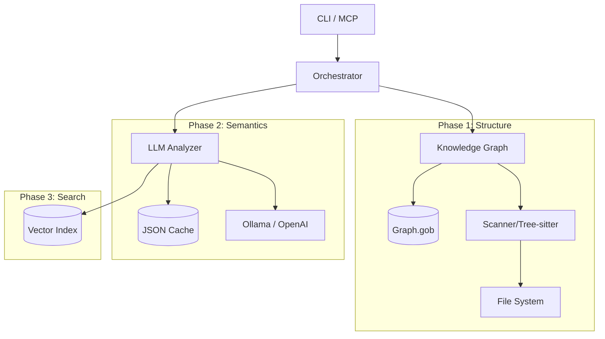

# Master Plan: Codemap GraphRAG

**Status**: ✅ COMPLETE
**Architecture**: Monolithic CLI + MCP Server
**Completed**: 2024-12-04

## Vision
Transform `codemap` from a structural mapper into a **GraphRAG (Graph-based Retrieval Augmented Generation)** system. This will allow LLM agents to "understand" the codebase through pre-computed summaries, relationship mapping (Call Graph), and semantic search, rather than just reading raw file trees.

## Implementation Roadmap

The implementation is broken down into three sequential phases to ensure stability and testability.

### ⚠️ Critical Constraints
1.  **Portability**: Must remain easily cross-compilable (Linux/Mac/Windows). Avoid CGO where possible (e.g., use `modernc.org/sqlite` or pure Go equivalents).
2.  **Performance**: `codemap` is a CLI tool. Startup time and index speed are paramount.
3.  **Token Efficiency**: All outputs must be optimized to save context window space for Agents.

### [Phase 1: Knowledge Graph Foundation](./development-docs/plans/01_knowledge_graph.md)
*   **Goal**: Build the "Skeleton". Syntactic Call Graph, Persistence, and Graph Querying.
*   **Key Tech**: `encoding/gob` (Storage), Tree-sitter (Parsing).
*   **New Commands**: `index`, `query`, `trace`.

### [Phase 2: Semantic Intelligence](./development-docs/plans/02_llm_integration.md)
*   **Goal**: Add the "Brain". Connect to LLMs (Ollama/OpenAI) to explain and summarize.
*   **Key Tech**: LLM Clients, Caching (ContentHash), Configuration.
*   **New Commands**: `explain`, `summarize`.

### [Phase 3: Hybrid Retrieval](./development-docs/plans/03_hybrid_retrieval.md)
*   **Goal**: Add the "Eyes". Natural language search merging Graph + Embeddings.
*   **Key Tech**: Vector Search (In-Memory/Pure Go), Rank Fusion.
*   **New Commands**: `search`.

## Architecture Overview

## Implementation Complete

All three phases have been successfully implemented:

1. **Phase 1**: Knowledge Graph with gob persistence, call graph extraction for 6 languages
2. **Phase 2**: LLM integration with Ollama/OpenAI/Anthropic, caching, explain/summarize commands
3. **Phase 3**: Hybrid search with vector index and Reciprocal Rank Fusion

See `TASKS.md` for detailed implementation notes and validation results.